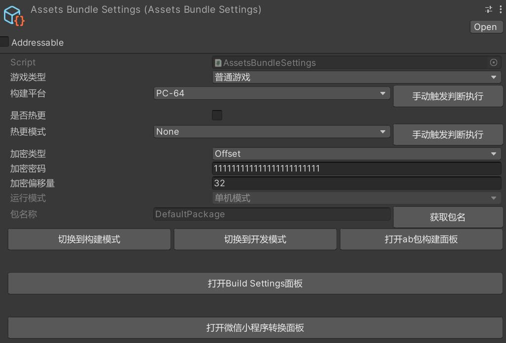
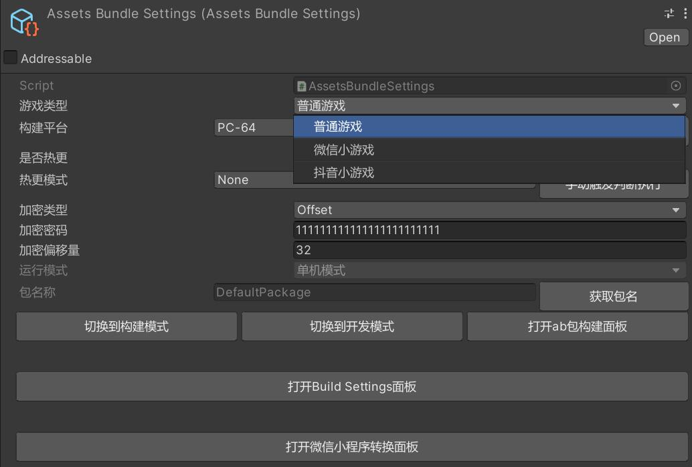
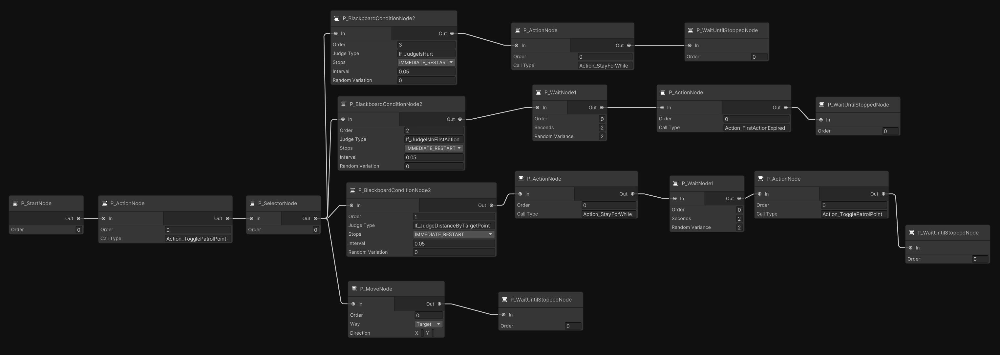

# MJFramework

## 需要其他插件：
### Odin（ https://github.com/TeamSirenix/odin-serializer ）
### SLATE Cinematic Sequencer（ https://slate.paradoxnotion.com ）
### Animancer（ https://kybernetik.itch.io/animancer-pro ）

## 框架介绍：
+ 框架是以组件模式进行构造的，所有业务脚本都是以组件的形式绑定在Entity上，通过组件模式可以很方便的进行扩展和修改，Entity本身没有任何东西，他是Component的容器，也是Unity世界游戏物体关联的桥梁
+ 框架的事件系统支持多种类型的事件，事件系统也是框架的核心之一，事件系统的核心结构是一个数据结构：StaticLinkedListDictionary
+ 框架自己实现了一套Component的生命周期系统，所有Component的生命周期是可控的，可以通过特性 [FunctionSort] 设置Update、LateUpdate、FixedUpdate的执行顺序
+ 框架实现了一套UI管理系统，可以很方便的管理UI的层级和进行UI的打开、关闭等操作，通过特性 [UIBaseData] 进行设置，比如：
    ````csharp
    [UIBaseData(UIViewType = (int)UIViewType.Normal, PrefabPath = "Assets/Res/StartView.prefab",UIMaskMode = (int)UIMaskMode.BlackTransparentClick, UILayer = (int)Model.UIViewLayer.Normal, IsFullScreen = true, IsOperateMask = false)]
    ````
    可以很方便的管理UI
+ 框架使用YooAsset进行资源管理，加载资源的方法全都在AssetsComponent这个脚本里
+ 打包设置的文件：
    除了PC、Android、iOS三个平台的设置外，还有额外有微信小游戏和抖音小游戏的设置：
    目前已适配了微信小游戏和抖音小游戏
+ 框架里有一套行为树系统，是拓展NPBehave的，行为树编辑器是由NodeGraphProcessor做的，早期是由xNode做的，里面的小怪的行为树：
+ MAStar：一个可扩展的A*寻路组件